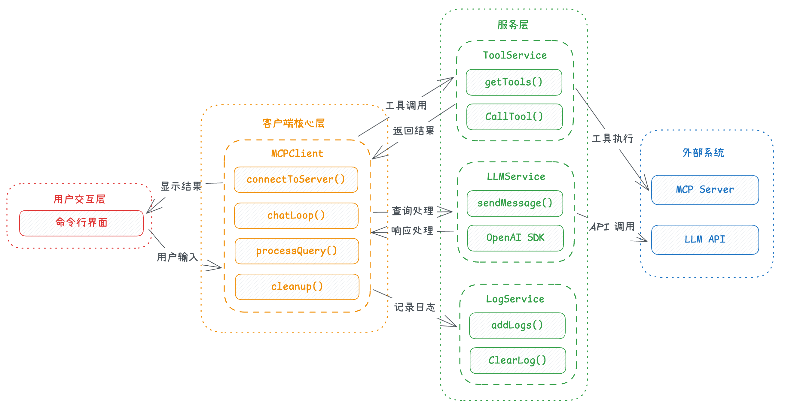
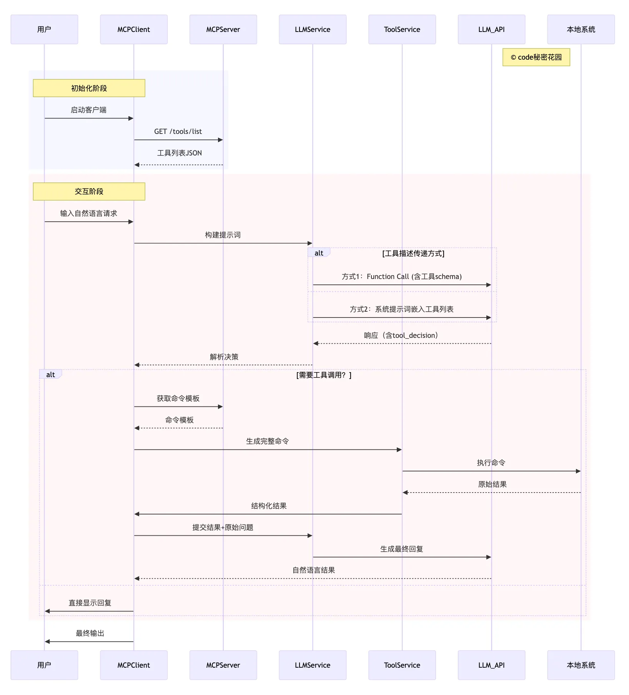
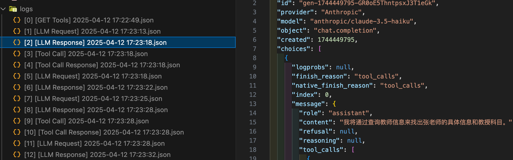
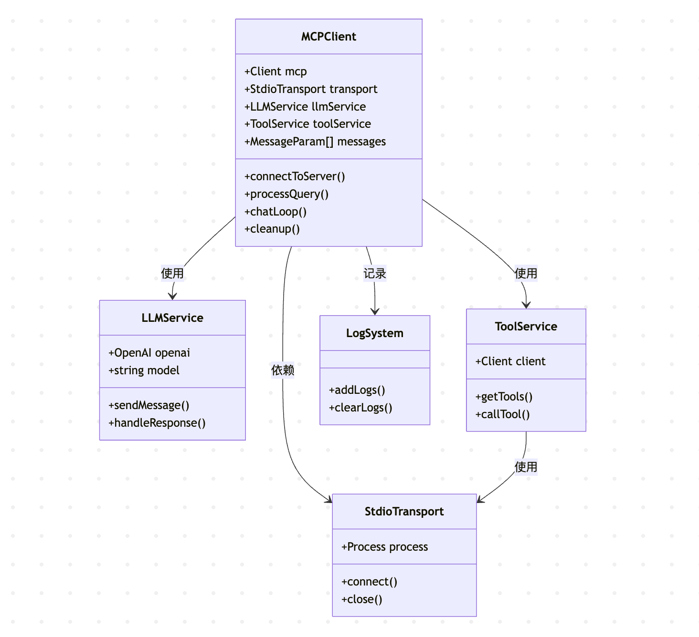

## 项目介绍

MCP Client 是一个基于 Model Context Protocol 的 Node.js 客户端实现（使用 Function Calling），它允许您的应用连接到各种 MCP 服务器，并通过大语言模型（LLM）与这些服务器交互。MCP（模型上下文协议）是一个开放协议，用于标准化应用程序向 LLM 提供上下文的方式。




## 核心特性

- 支持连接任何符合 MCP 标准的服务器
- 支持兼容 OpenAI API 格式的 LLM 能力
- 自动发现和使用服务器提供的工具
- 完善的日志记录系统，包括 API 请求和工具调用
- 交互式命令行界面
- 支持工具调用和结果处理

## 系统要求

- Node.js 17 或更高版本
- LLM API 密钥（暂不支持 Ollama）
- 磁盘空间用于存储日志文件（位于 `logs/` 目录）

## 安装

### 1. 克隆仓库

```bash
git clone https://github.com/ConardLi/mcp-client-nodejs.git
cd mcp-client-nodejs
```

### 2. 安装依赖

```bash
npm install
```

所需依赖项：
- @modelcontextprotocol/sdk
- openai
- dotenv
- typescript（开发依赖）
- @types/node（开发依赖）

### 3. 配置环境变量

复制示例环境变量文件并设置您的 LLM API 密钥：

```bash
cp .env.example .env
```

然后编辑 `.env` 文件，填入您的 LLM API 密钥、模型提供商 API 地址、以及模型名称：

```
OPENAI_API_KEY=your_api_key_here
MODEL_NAME=xxx
BASE_URL=xxx
```

### 4. 编译项目

```bash
npm run build
```

## 使用方法

要启动 MCP 客户端，您可以使用以下几种方式：

### 1. 直接指定服务器脚本路径

```bash
node build/index.js <服务器脚本路径>
```

其中 `<服务器脚本路径>` 是指向 MCP 服务器脚本的路径，可以是 JavaScript (.js) 或 Python (.py) 文件。

### 2. 使用配置文件

```bash
node build/index.js <服务器标识符> <配置文件路径>
```

其中 `<服务器标识符>` 是配置文件中定义的服务器名称，`<配置文件路径>` 是包含服务器定义的 JSON 文件的路径。

```json
{
  "mcpServers": {
    "time": {
      "command": "node",
      "args": [
        "/Users/xxx/mcp/dist/index.js"
      ],
      "description": "自定义 Node.js MCP服务器"
    },
    "mongodb": {
      "command": "npx",
      "args": [
        "mcp-mongo-server",
        "mongodb://localhost:27017/studentManagement?authSource=admin"
      ]
    }
  },
  "defaultServer": "mongodb",
  "system": "自定义系统提示词"
}
```


### 3. 使用 npm 包（npx）

您可以直接通过 npx 运行这个包，无需本地克隆和构建：

```bash
# 直接连接脚本
$ npx mcp-client-nodejs /path/to/mcp-server.js

# 通过配置文件连接
$ npx mcp-client-nodejs mongodb ./mcp-servers.json
```

> 注意：需要在当前运行目录的 .env 配置模型相关信息


### 示例

直接连接 JavaScript MCP 服务器：
```bash
node build/index.js /path/to/weather-server/build/index.js
```

直接连接 Python MCP 服务器：
```bash
node build/index.js /path/to/mcp-server.py
```

使用配置文件连接服务器：
```bash
node build/index.js mongodb ./mcp-servers.json
```

使用 npx 运行：

```bash
# 直接连接脚本
$ npx mcp-client-nodejs /path/to/mcp-server.js
# 通过配置文件连接
$ npx mcp-client-nodejs mongodb./mcp-servers.json
```


## 工作原理



1. **服务器连接**：客户端连接到指定的 MCP 服务器
2. **工具发现**：自动获取服务器提供的可用工具列表
3. **查询处理**：
   - 将用户查询发送给 LLM
   - LLM 决定是否需要使用工具
   - 如果需要，客户端通过服务器执行工具调用
   - 将工具结果返回给 LLM
   - LLM 提供最终回复
4. **交互式循环**：用户可以不断输入查询，直到输入"quit"退出

## 日志系统

MCP Client 包含一个全面的日志系统，详细记录所有关键操作和通信。日志文件保存在 `logs/` 目录中，以 JSON 格式存储，方便查询和分析。



### 日志类型

- **LLM 的请求和响应** - 记录与 LLM API 的所有通信
- **工具调用和结果** - 记录所有工具调用参数和返回结果
- **错误信息** - 记录系统运行期间的任何错误

### 日志命名和格式

日志文件连统命名为 `[index] [log_type] YYYY-MM-DD HH:MM:SS.json`，包含序号、日志类型和时间戳，方便按时间顺序查看整个会话。

## 架构设计




MCP Client 基于模块化的客户端-服务器架构：
- **传输层**：使用 Stdio 传输机制与服务器通信
- **协议层**：使用 MCP 协议处理请求/响应和工具调用
- **模型层**：通过 OpenAI SDK 提供 LLM 能力

### 核心组件

- **MCPClient 类**：管理服务器连接、处理查询和工具调用
- **Client 对象**：MCP SDK 提供的客户端实现
- **StdioClientTransport**：基于标准输入/输出的传输实现

## 最佳实践

- **错误处理**：使用 TypeScript 类型系统进行更好的错误检测
- **安全性**：在 .env 文件中安全存储 API 密钥
- **工具权限**：注意工具的权限和安全性

## 故障排除

### 服务器路径问题

- 确保服务器脚本路径正确
- 如果相对路径不起作用，请使用绝对路径
- Windows 用户请确保在路径中使用正斜杠(/)或转义的反斜杠(\\)
- 验证服务器文件具有正确的扩展名(.js 或 .py)

### 响应时间

- 第一次响应可能需要最多 30 秒才能返回
- 这是正常现象，发生在服务器初始化、查询处理和工具执行期间
- 后续响应通常会更快

### 常见错误消息

- `Error: Cannot find module`：检查构建文件夹并确保 TypeScript 编译成功
- `Connection refused`：确保服务器正在运行且路径正确
- `Tool execution failed`：验证工具所需的环境变量是否已设置
- `OPENAI_API_KEY is not set`：检查您的 .env 文件和环境变量
- `TypeError`：确保为工具参数使用正确的类型

## 许可证

Apache License 2.0

